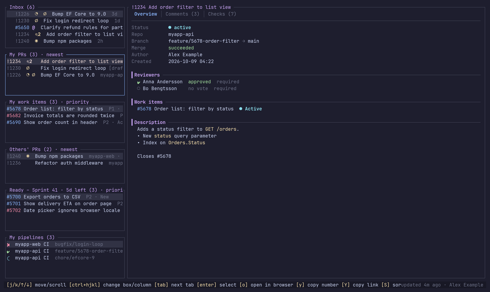
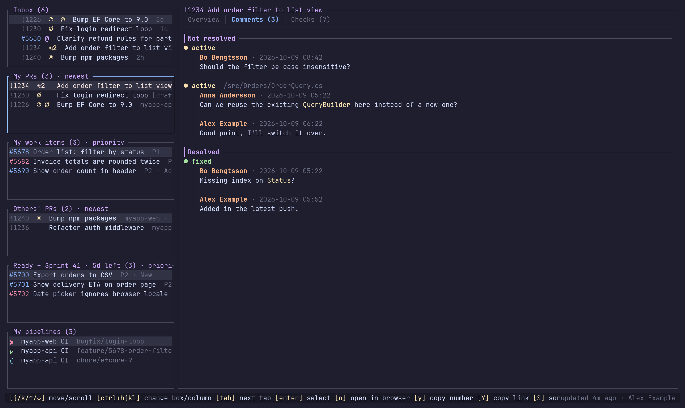
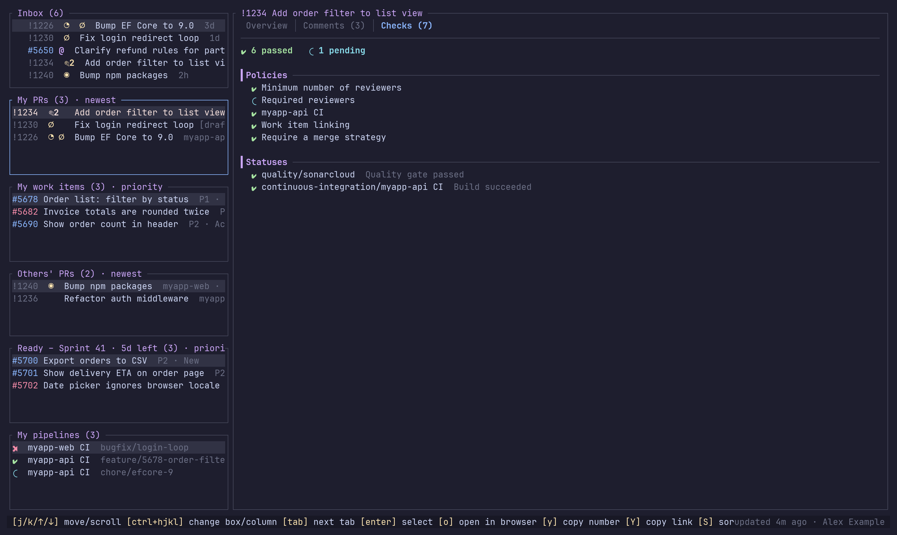
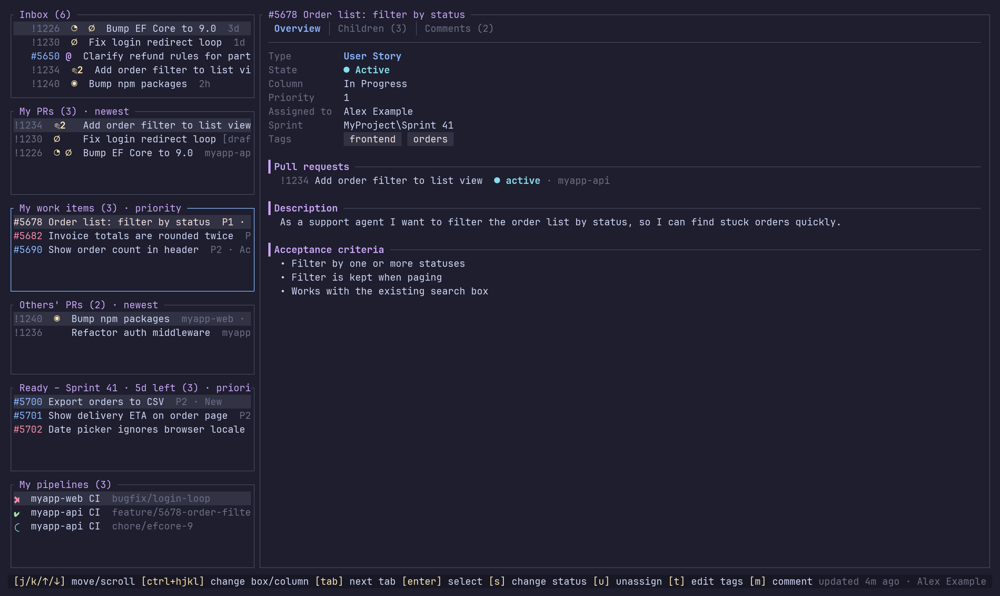
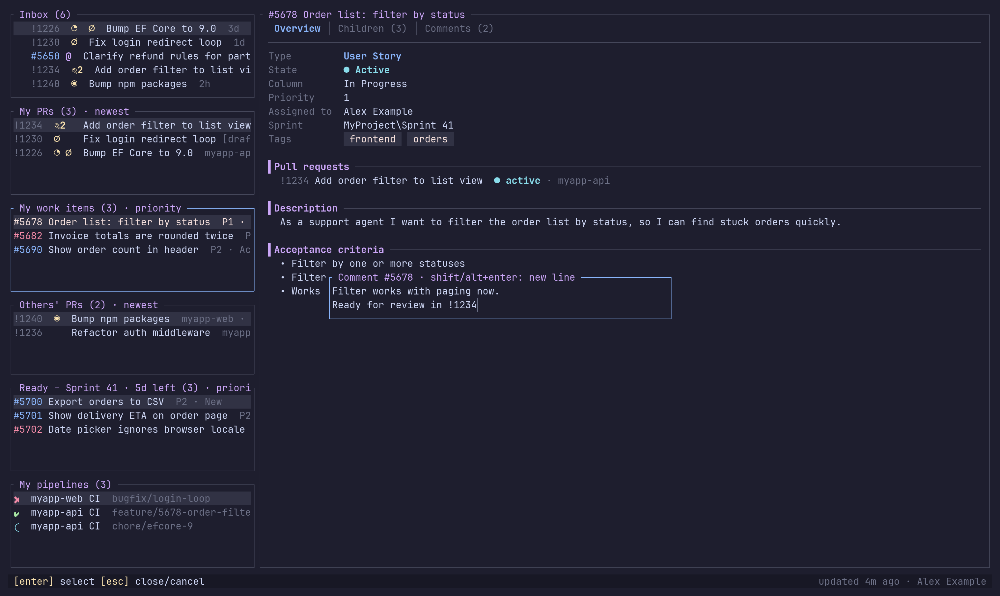
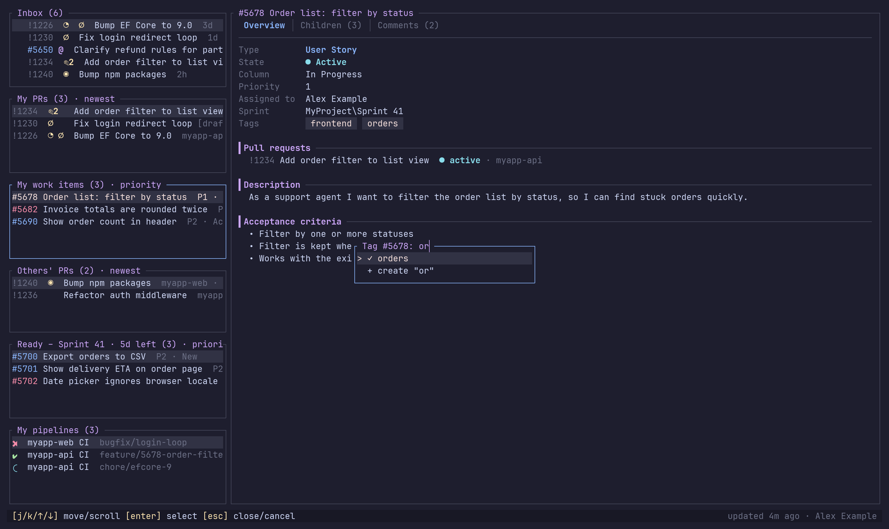
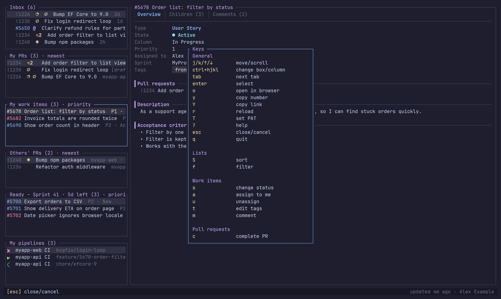

# azuredevopstui

A terminal UI for keeping track of your work in Azure DevOps. It shows your pull requests, your work items, other people's pull requests and the items that are ready to be picked up in the current sprint, all in one keyboard-driven screen.

Built with [ratatui](https://ratatui.rs). Catppuccin Mocha is the default theme.



## Features

- **Six lists** on the left:
  - **Inbox**: everything that waits on you, oldest first: your PRs with markers, others' PRs that need your vote or answer, work items where someone mentioned you, and your failed pipeline runs. Entries that showed up since the first refresh get a `•` until you open them.
  - **My PRs**: active pull requests you created, across all repositories in the project, marked with what needs your attention. See [PR markers](#pr-markers).
  - **My work items**: open items assigned to you in the current sprint, limited to the chosen work item types.
  - **Others' PRs**: active pull requests created by someone else, marked with what waits on you. See [Review markers](#review-markers). You can filter them by reviewer or creator.
  - **Ready**: items in the current sprint that sit in your *ready* board column and are not assigned to you. The title shows the work days left in the sprint.
  - **My pipelines**: the latest run per pipeline and branch that you triggered in the last 14 days, also for branches without a PR. Pull request runs are left out; they show up in the PR's checks.
- **Sprint overview** in the detail panel when nothing is open: the sprint dates, the work days left and your items per board column. `esc` closes an open item and brings it back.
- **Sprint picker**: press `i` to show another sprint than the current one. See [Sprint](#sprint).
- **Detail panel** with tabs:
  - **Pipeline run**: pipeline, run number, branch, status, reason, times and duration.
  - **Pull request**:
    - **Overview** shows status, branches, merge status, reviewers and their votes, the linked work items (with a warning when there are none), and the description.
    - **Comments** shows the comment threads with their status and file path.
    - **Checks** shows the branch policies and statuses, with a summary of passed, failed and pending.
  - **Work item**:
    - **Overview** shows type, state, board column, priority, assignee, sprint, tags, linked pull requests, description, repro steps and acceptance criteria.
    - **Children** shows child items grouped by type (Task, Release Task, User Story, …), each with state and assignee.
    - **Comments** shows the 10 newest comments.
  - **Images** in descriptions and comments are drawn inline when the terminal supports graphics. See [Images](#images).
- **Actions**:
  - Open a PR or work item in the browser.
  - Move a work item to another board column. The columns come from your team's board, and split columns (for example *Active → Doing / Done*) are supported.
  - Assign a work item to yourself.
  - Unassign yourself from a work item and pick its new board column in the same step.
  - Complete one of your PRs once it shows `✔`. You pick a merge strategy among the ones the branch policies allow, and the last one you used is preselected. `esc` cancels without completing.
- **Sorting** per list type. The choice is saved to the config.
- **Work item type filter**: pick which types (User Story, Bug, Feature, …) the work item lists show. The list of types comes from the project, and the choice is saved to the config.
- **Auto refresh** at a configurable interval. The open detail view refreshes too.
- **Setup wizard** on first start. Organization, project, team and the ready column are picked from lists fetched from Azure DevOps.
- **Authentication** uses the Azure CLI first and falls back to a Personal Access Token stored in the OS keyring.

## Screenshots

All screenshots use made-up data.

**Pull request comments**, grouped by status with file paths:



**Pull request checks**: branch policies and statuses:



**Work item** with tags, linked pull requests, description and acceptance criteria:



**Commenting** on a work item:



**Tag picker**: type to search, or create a new tag:



**Help** with all keys:



## Requirements

- **Rust**: a toolchain with edition 2024 support (Rust 1.88 or newer).
- **Azure CLI** (recommended): you must be logged in with `az login`.
- **For PAT authentication**: an OS keyring.
  - **Linux**: a keyring that implements the Secret Service API (`org.freedesktop.secrets`), for example:
    - **GNOME Keyring** (`gnome-keyring`): the default on GNOME and works on most other desktops and window managers.
    - **KWallet** (`kwallet`): the default on KDE Plasma. It provides the Secret Service API since KDE Frameworks 5.97, so make sure the wallet is enabled.
    - **KeePassXC**: enable *Secret Service Integration* in its settings.
  - **WSL**: one running inside the distro, for example `gnome-keyring-daemon`. Otherwise the PAT cannot be stored.
  - **Windows**: Windows Credential Manager, which is built in.
- **Terminal**: one with true color support. A terminal that supports the kitty keyboard protocol gives you `ctrl+h`/`ctrl+j`. In other terminals, use `ctrl+arrow` instead.

## Install

### Download a release

Prebuilt binaries for Linux (`x86_64-unknown-linux-gnu`) and Windows (`x86_64-pc-windows-msvc`) are attached to every [GitHub release](https://github.com/ferenyl/azuredevopstui/releases).

Linux:

```sh
tar -xzf azuredevopstui-<version>-x86_64-unknown-linux-gnu.tar.gz
install -Dm755 azuredevopstui-<version>-x86_64-unknown-linux-gnu/azuredevopstui ~/.local/bin/azuredevopstui
```

Make sure `~/.local/bin` is on your `PATH`. The Linux binary is built on Ubuntu 24.04, so it needs glibc 2.39 or newer.

Windows (PowerShell):

```powershell
Expand-Archive azuredevopstui-<version>-x86_64-pc-windows-msvc.zip -DestinationPath .
New-Item -ItemType Directory -Force "$env:LOCALAPPDATA\Programs\azuredevopstui" | Out-Null
Copy-Item azuredevopstui-<version>-x86_64-pc-windows-msvc\azuredevopstui.exe "$env:LOCALAPPDATA\Programs\azuredevopstui\"
```

Then add `%LOCALAPPDATA%\Programs\azuredevopstui` to your user `PATH`.

### Install from crates.io

```sh
cargo install azuredevopstui --locked
```

This downloads the source from [crates.io](https://crates.io/crates/azuredevopstui) and builds it on your machine. On Windows that needs the Visual Studio Build Tools; see [Windows](#windows). Upgrade by running the same command again.

### Install from source

`cargo install` builds in release mode and puts the binary in `~/.cargo/bin` (`%USERPROFILE%\.cargo\bin` on Windows), which rustup has already added to your `PATH`:

```sh
git clone https://github.com/ferenyl/azuredevopstui.git
cd azuredevopstui
cargo install --path . --locked
```

Run the same command again to upgrade after a `git pull`. To remove the app, run `cargo uninstall azuredevopstui`.

### Build a release binary without installing

```sh
cargo build --release --locked
```

The binary ends up in `target/release/azuredevopstui` (`target\release\azuredevopstui.exe` on Windows). Run it directly or copy it to a directory on your `PATH`:

```sh
./target/release/azuredevopstui
cp target/release/azuredevopstui ~/.local/bin/
```

To build the Windows binary from WSL or Linux, see [Windows](#windows).

### Continuous integration

`.github/workflows/ci.yml` runs on every pull request and every push to `main`, on both Linux and Windows:

- `cargo fmt --check` (Linux only)
- `cargo clippy` (warnings fail the build)
- `cargo test`
- `cargo build`

The release workflow calls the same file, so a release is only built and published once CI passes.

Run the same checks locally before you open a pull request:

```sh
cargo fmt --check
cargo clippy --all-targets -- -D warnings
cargo test
```

The tests are unit tests next to the code (`#[cfg(test)] mod tests`). API calls are tested against a local mock server ([wiremock](https://crates.io/crates/wiremock)), and the UI is rendered to ratatui's `TestBackend`. No test talks to Azure DevOps, the keyring, `az` or your config file.

### Publishing a release

`.github/workflows/release.yml` runs when a GitHub release is published. It first runs [CI](#continuous-integration), then:

1. Create a release on GitHub with a new tag, for example `v0.2.0`. You can do it in the web UI or run `gh release create v0.2.0 --title v0.2.0 --notes ""`.
2. The workflow adds every commit since the previous release tag to the release notes, under *Changes since \<previous tag\>*. Merge commits are skipped. For the first release, every commit is listed. Text you wrote in the release yourself is kept above the list.
3. It builds the release binaries for Linux and Windows and attaches them to the release:
   - `azuredevopstui-<tag>-x86_64-unknown-linux-gnu.tar.gz`
   - `azuredevopstui-<tag>-x86_64-pc-windows-msvc.zip`

   Each archive contains the binary and this README.
4. When both builds succeed, it publishes the crate to crates.io with `cargo publish --locked`.

Re-running the workflow replaces the assets and the changes list; it does not duplicate them. A crates.io version can only be published once, so the publish step fails on a re-run of the same version.

Before you create a release, make sure that:

- **The tag is a version.** The workflow takes the version from the tag, so you don't need to change `Cargo.toml` yourself. Before it builds and publishes, it writes the tag without the leading `v` into `version` in `Cargo.toml` and `Cargo.lock`, so tag `v0.2.0` gives version `0.2.0`. The tag must look like `v1.2.3` or `1.2.3`, optionally with a pre-release suffix such as `v1.2.3-beta.1`; otherwise the workflow stops. The change is only made inside the workflow and is never committed, so `version` in the repo can stay at its old value.
- **The crates.io token is set up.** You only do this once:
  1. Log in to [crates.io](https://crates.io) with GitHub.
  2. Verify your email address under *Account Settings*.
  3. Create a token under *Account Settings → API Tokens* with the scopes `publish-new` and `publish-update`.
  4. Add the token as the repository secret `CARGO_REGISTRY_TOKEN` (*Settings → Secrets and variables → Actions → New repository secret*), or run `gh secret set CARGO_REGISTRY_TOKEN`.

## Windows

The app runs natively on Windows. Use Windows Terminal; the old console host lacks some of the symbols.

- **Build on Windows**: install Rust with the MSVC toolchain and the Visual Studio Build Tools (C++ workload), then run `cargo install --path .` in PowerShell. Clone the repo on the Windows file system, not under `\\wsl$`.
- **Cross-compile from WSL or Linux**: install the MinGW compiler (`mingw-w64-gcc` on Arch), then run:
  ```sh
  rustup target add x86_64-pc-windows-gnu
  cargo build --release --target x86_64-pc-windows-gnu
  ```
  The binary ends up in `target/x86_64-pc-windows-gnu/release/azuredevopstui.exe`.
- **Azure CLI**: use the Windows version of Azure CLI. It has its own login, separate from WSL, so run `az login` in PowerShell. Use `azure_config_dir` there too if you have separate DevOps and cloud accounts; see [Separate account for Azure DevOps](#separate-account-for-azure-devops-azure_config_dir).
- **Run it from Windows**: start the `.exe` from PowerShell or cmd in Windows Terminal, not from a WSL shell.
- **Paths**:
  - Config: `%APPDATA%\azuredevopstui\config.json`
  - Log: `%LOCALAPPDATA%\azuredevopstui\log`
  - PAT: Credential Manager → *Windows Credentials*, as the entry `azuredevopstui`.
- **Keys**: `ctrl+h/j/k/l` work directly in Windows Terminal. No kitty keyboard protocol is needed.

## First start

When there is no config file, the app runs a setup:

1. **Sign in**: uses the Azure CLI token. If that fails, the error is shown and you can press `r` to try again (for example after `az login`) or `T` to enter a PAT. The PAT is saved in the OS keyring.
2. **Organization**: picked from the organizations your account belongs to. If the list cannot be fetched (for example with a PAT that is limited to one organization), you type the name or paste the URL, such as `https://dev.azure.com/myorg`.
3. **Project** and then **team**: picked from lists.
4. **Ready column**: picked from your team's board columns.

The config is then written to disk, with the default colors filled in. If `ready_column` is ever removed from the config, the app asks for it again on the next start.

## Authentication

The method is set by `auth.method` in the config.

| Method | Behaviour |
|---|---|
| `auto` (default) | Use the Azure CLI. If that fails, use the PAT from the keyring. If there is none, show the az error and let you try again (`r`) or enter a PAT (`t`). When `azure_config_dir` is set, an az failure is shown instead of falling back to a saved PAT. |
| `azcli` | Only use the Azure CLI. |
| `pat` | Only use the PAT from the keyring. |

### Azure CLI

The app runs `az account get-access-token --resource 499b84ac-1321-427f-aa17-267ca6975798` and renews the token when it expires.

If your tenant has no Azure subscriptions, log in with:

```sh
az login --allow-no-subscriptions --tenant <tenant-id>
```

### Finding your tenant ID

`<tenant-id>` is the ID of the Microsoft Entra directory that your Azure DevOps organization is connected to.

1. Open `https://dev.azure.com/<organization>/_settings/organizationAad`, or go to *Organization settings → Microsoft Entra*.
2. The page shows the connected directory. Copy its ID, which is a GUID.

### Separate account for Azure DevOps (`azure_config_dir`)

Some setups use one account for Azure DevOps and another for the Azure portal, for example a cloud or admin account. The Azure CLI has one active account per config directory, so logging in with one account replaces the other.

The fix is to give the DevOps account its own Azure CLI login. The Azure CLI keeps its login in `~/.azure` by default, or in the directory set by the `AZURE_CONFIG_DIR` environment variable. Each directory is a separate login, so both accounts can stay logged in at the same time.

**1. Log in the DevOps account in its own directory (once)**

Linux / WSL / macOS:

```sh
AZURE_CONFIG_DIR=~/.azure-devops az login --allow-no-subscriptions --tenant <tenant-id>
```

Windows (PowerShell):

```powershell
$env:AZURE_CONFIG_DIR="$HOME\.azure-devops"; az login --allow-no-subscriptions --tenant <tenant-id>
Remove-Item Env:AZURE_CONFIG_DIR
```

For `<tenant-id>`, see [Finding your tenant ID](#finding-your-tenant-id). Pick the DevOps account in the browser. The variable only applies to that command or session, so your normal `az` keeps using the cloud account in `~/.azure`.

**2. Point the app at it**

```json
"auth": {
  "method": "auto",
  "azure_config_dir": "~/.azure-devops"
}
```

`~` is expanded to your home directory on all platforms. An absolute path such as `"C:\\Users\\me\\.azure-devops"` also works.

**3. Use the Azure CLI as usual for the cloud account**

```sh
az login                   # cloud account, stored in ~/.azure
az account show            # shows the cloud account
```

The app sets `AZURE_CONFIG_DIR` only for its own `az account get-access-token` calls. It never changes your shell or the default login.

When the DevOps login expires, the app shows *Setup failed* with the exact `az login` command to run. Run it and press `r` to retry. Check which account the DevOps login uses with:

```sh
AZURE_CONFIG_DIR=~/.azure-devops az account show
```

### Personal Access Token

Create a PAT in Azure DevOps (*User settings → Personal access tokens*) with these scopes:

- **Code**: Read
- **Work Items**: Read & Write
- **Project and Team**: Read
- **Identity**: Read, needed only if you use `other_prs_filter`

The token is stored in the OS keyring under the service `azuredevopstui`. If Azure DevOps rejects it, the app removes it and asks for a new one. Press `T` to replace it at any time.

## Configuration

The config file is `$XDG_CONFIG_HOME/azuredevopstui/config.json`, which is usually `~/.config/azuredevopstui/config.json`. On Windows it is `%APPDATA%\azuredevopstui\config.json`.

```json
{
  "organization": "contoso",
  "project": "MyProject",
  "team": "My Team",
  "refresh_interval_secs": 120,
  "browser_command": null,
  "auth": { "method": "auto", "azure_config_dir": "~/.azure-devops" },
  "other_prs_filter": {
    "reviewers": ["[MyProject]\\Developers", "anna.andersson@example.com"],
    "creators": []
  },
  "ready_column": "Ready",
  "default_sprint": "MyProject\\Sprint 42",
  "work_item_types": [],
  "show_images": true,
  "sort": {
    "pull_requests": "newest",
    "work_items": "priority"
  },
  "colors": { "background": "#1E1E2E", "...": "..." }
}
```

| Key | Default | Description |
|---|---|---|
| `organization` | set by setup | Azure DevOps organization (`dev.azure.com/<organization>`). |
| `project` | set by setup | Project name. |
| `team` | set by setup | Team. Used for the current sprint and the board. |
| `refresh_interval_secs` | `120` | Auto refresh interval in seconds. Set it to `0` to turn auto refresh off. Auto refresh pauses while a popup is open. |
| `browser_command` | `null` | Command used to open URLs, with the URL appended as the last argument, for example `"wslview"` or `"firefox --new-tab"`. The command is split on spaces, so it must be on `PATH` (use `"chrome"`, not `"C:\\Program Files\\…"`). When `null`, the system default is used. |
| `auth.method` | `"auto"` | `auto`, `azcli` or `pat`. See [Authentication](#authentication). |
| `auth.azure_config_dir` | not set | Azure CLI config directory for the DevOps login, for example `"~/.azure-devops"`. Use it when the DevOps account differs from your Azure portal account. When not set, the default `~/.azure` is used. See [Separate account for Azure DevOps](#separate-account-for-azure-devops-azure_config_dir). |
| `other_prs_filter.reviewers` | `[]` | Show PRs where any of these users or groups is a reviewer. |
| `other_prs_filter.creators` | `[]` | Show PRs created by any of these users or groups. |
| `other_prs_filter.show_approved` | `false` | Also show PRs whose reviewer policies are approved (set with `f`). |
| `other_prs_filter.show_drafts` | `false` | Also show draft PRs (set with `f`). |
| `ready_column` | set by setup | The board column treated as *ready*. |
| `default_sprint` | not set | Iteration path of the sprint shown at start instead of the team's current sprint, for example `"MyProject\\Sprint 42"`. See [Sprint](#sprint). |
| `work_item_types` | `[]` | Work item types shown in *My work items* and *Ready*, for example `["User Story", "Bug"]`. An empty array shows all types. |
| `show_images` | `true` | Draw images in the detail panel when the terminal supports graphics. Set it to `false` to skip the terminal graphics query at startup. |
| `sort.pull_requests` | `"newest"` | Sort order for both PR lists. |
| `sort.work_items` | `"priority"` | Sort order for both work item lists. |
| `colors` | Catppuccin Mocha | Theme colors. See [Colors](#colors). |

### Others' PRs filter

When both arrays are empty, the list shows every active PR in the project, across all repositories, except your own.

Entries can be users, given as email or display name, or groups, given as `[Project]\Group` (escape the backslash in JSON: `"[MyProject]\\Developers"`). Each entry is resolved through the identities API. A PR is shown if it matches any entry, and duplicates are removed.

### Sorting

Press `S` on a list to choose the order. PR lists and work item lists each have their own setting, which is shared by the two lists of that kind and saved to the config straight away.

| `sort.pull_requests` | Order |
|---|---|
| `newest` | Most recently created first |
| `oldest` | Oldest first |
| `title` | Title A–Z |
| `repository` | Repository A–Z, then newest |

| `sort.work_items` | Order |
|---|---|
| `priority` | Priority 1–4, with items that have no priority last; ties go to the most recently changed |
| `changed` | Most recently changed first |
| `created` | Most recently created first |
| `state` | State A–Z, then most recently changed |
| `id` | ID ascending |

### Work item types

Press `f` to open a list of all work item types used in the project. Hidden types such as test plans and code reviews are left out. Use `space` to tick or untick a type, and `enter` to save the choice to `work_item_types` and reload the lists. The filter applies to both work item lists. All types are shown by default, and ticking every type (or none) also shows all of them.

On a PR, `f` instead opens the filter for others' PRs: tick *Show approved* and *Show drafts* to list those too. Both are hidden by default. A PR counts as approved when all its blocking reviewer policies are approved, or, without such policies, when someone has approved it. Your own PRs are always all shown.

### Sprint

The work item lists and the sprint overview show the team's current sprint, or `default_sprint` when it is set. Press `i` to pick another sprint: the list shows all of the team's sprints with their dates, furthest in the future first, and marks the current one. Type to search by iteration path and press `enter` to show that sprint. The choice lasts until the app is restarted; set `default_sprint` to keep it.

### Colors

Each value is a hex color, such as `"#89B4FA"`. A key that is missing falls back to its Mocha default.

| Key | Default | Used for |
|---|---|---|
| `background` | `#1E1E2E` | App background |
| `foreground` | `#CDD6F4` | Text |
| `border` | `#45475A` | Borders, rules, comment bars |
| `border_focused` | `#89B4FA` | Focused box, active tab |
| `selection_bg` | `#313244` | Selected row, tag background |
| `selection_fg` | `#F5E0DC` | Selected row text (focused box), tag text |
| `title` | `#CBA6F7` | Box titles, section headings |
| `toolbar_bg` | `#181825` | Toolbar background |
| `toolbar_key` | `#F9E2AF` | Key hints |
| `pr_approved` | `#A6E3A1` | Approved votes, completed PRs, done states |
| `pr_waiting` | `#F9E2AF` | Waiting votes, drafts, active threads |
| `pr_rejected` | `#F38BA8` | Rejected votes |
| `build_succeeded` | `#A6E3A1` | Passed checks |
| `build_failed` | `#F38BA8` | Failed checks |
| `build_running` | `#89DCEB` | Pending checks, active PRs, active states |
| `workitem_bug` | `#F38BA8` | Bugs |
| `workitem_story` | `#89B4FA` | Stories and other types |
| `workitem_task` | `#F9E2AF` | Tasks |
| `comment_author` | `#FAB387` | Comment authors |
| `muted` | `#6C7086` | Labels and secondary text |
| `error` | `#F38BA8` | Errors, merge conflicts |

## Keys

| Key | Action |
|---|---|
| `j` / `k`, `↓` / `↑` | Move in a list, or scroll the detail panel |
| `ctrl+j` / `ctrl+k`, `ctrl+↓` / `ctrl+↑` | Previous or next box in the left column |
| `ctrl+l` / `ctrl+h`, `ctrl+→` / `ctrl+←` | Switch between the left column and the detail panel |
| `enter` | Open the selected item in the detail panel |
| `tab` / `shift+tab` | Next or previous detail tab |
| `S` | Choose the sort order for the focused list |
| `f` | Choose which work item types are shown, or on a PR, filter others' PRs |
| `space` | Tick or untick an item in the type list |
| `i` | Pick the sprint to show: type to search, `enter` selects |
| `s` | Move a work item to another board column |
| `a` | Assign a work item to yourself |
| `u` | Unassign yourself from a work item: pick the new column, then `enter`. `esc` cancels and nothing changes |
| `t` | Edit tags on your work item: type to search, `enter` adds the tag or removes it if it is already set (✓). A tag that does not exist is created |
| `m` | Comment on a work item: type the text, `shift+enter` or `alt+enter` for a new line, `enter` sends. `esc` cancels |
| `c` | Complete your ready PR: pick the merge strategy, then `enter`. `esc` cancels and nothing is completed |
| `o` | Open the PR, work item or pipeline run in the browser |
| `y` | Copy the PR (`!1234`) or work item (`#5678`) number |
| `Y` | Copy the link to the PR, work item or pipeline run |
| `r` | Reload everything |
| `T` | Enter a new PAT |
| `?` | Show all keys |
| `esc` | Close a popup or cancel, or close the open item to show the sprint overview |
| `q`, `ctrl+c` | Quit |

Actions apply to the selected row in the focused list. When the detail panel has focus, they apply to the item shown there. The toolbar always shows the keys that work in the current context.

## PR markers

Each pull request in *My PRs* shows markers right after its ID when something needs your attention:

| Marker | Meaning |
|---|---|
| `✎2` | Unresolved comment threads (status *active* or *pending*), here 2 |
| `◔` | A reviewer voted *waiting for author* |
| `⊘` | A reviewer *rejected* the PR |
| `✖` | A blocking policy failed, for example the build, or a status check failed |
| `⇄` | Merge conflicts |

| `∅` | No work item is linked |
| `✔` | Approved and nothing blocks the merge; press `c` to complete |

No marker means nothing is waiting on you. The markers are refreshed together with the lists.

## Review markers

Others' PRs show what waits on you:

| Marker | Meaning |
|---|---|
| `◉` | You are a reviewer and have not voted |
| `↻` | New commits were pushed after you voted |
| `↩2` | Unresolved threads you started where someone else wrote last, here 2 |
| `@1` | Unresolved threads that mention you and that you have not answered, here 1 |

Work items in the inbox are marked `@` when a comment from the last 30 days mentions you and you have not commented after it.

## Images

Images in work item descriptions, repro steps, acceptance criteria and comments, and in PR descriptions and comments, are shown inline in the detail panel. This needs a terminal with a graphics protocol:

| Protocol | Terminals |
|---|---|
| Kitty graphics | kitty, Ghostty, WezTerm, Konsole |
| Sixel | Windows Terminal 1.22+, foot, xterm (`-ti vt340`), mlterm |
| iTerm2 | iTerm2, WezTerm |

The app detects the protocol at startup. Without one, an image is shown as a placeholder line such as `[image: screenshot.png]`. Open the item in the browser with `o` to see it.

- **Loading:** images download in the background and show `⟳ loading image…` until they are ready.
- **Size:** they are drawn at most 20 rows tall and never wider than the panel.
- **Scrolling:** an image that is only partly scrolled into view is left blank until it fits on screen.
- **Credentials:** images are only downloaded from Azure DevOps hosts (`dev.azure.com`, `*.visualstudio.com`), so your token is never sent anywhere else.

If startup hangs for a moment or the first key press is lost, the terminal does not answer the graphics query. Set `"show_images": false` to turn detection off.

## What the lists contain

- **My PRs**: `status=active` with you as the creator, across all repositories in the project.
- **Others' PRs**: `status=active`, filtered by `other_prs_filter` and with your own PRs excluded.
- **My work items**: `AssignedTo = @Me`, a state other than *Closed* or *Removed*, a type in `work_item_types` (all types when it is empty), and the shown sprint (see [Sprint](#sprint)).
- **Ready**: `BoardColumn = <ready_column>`, `AssignedTo <> @Me`, a type in `work_item_types` (all types when it is empty), and the shown sprint.

Moving a work item sets the board column field, the column's *Done* field (for split columns) and the matching `System.State`.

## Logging

Logs are written to `$XDG_STATE_HOME/azuredevopstui/log`, which is usually `~/.local/state/azuredevopstui/log`. On Windows the log is `%LOCALAPPDATA%\azuredevopstui\log`. The default level is `info`. Set it with `RUST_LOG`:

```sh
RUST_LOG=azuredevopstui=debug azuredevopstui
```

At `debug` level every API request is logged.

## Troubleshooting

| Problem | Fix |
|---|---|
| The Azure CLI token fails with *refresh token has expired* | Run `az login` again. Add `--allow-no-subscriptions` if the tenant has no subscriptions. |
| *unauthorized* (401 or 203) with a PAT | The PAT has expired or lacks a scope. The app asks for a new one; you can also press `t`. |
| The PAT cannot be saved | No Secret Service keyring is running. Start one (on WSL, `gnome-keyring-daemon`), or use the Azure CLI. On Windows, Credential Manager is always available. |
| Logging in with `az login` for DevOps breaks your Azure portal account, or the other way round | Use a separate login for DevOps with `auth.azure_config_dir`. See [Separate account for Azure DevOps](#separate-account-for-azure-devops-azure_config_dir). |
| *az login required, run `…`* | The Azure CLI login has expired or was never made. Run the command shown and press `r`. |
| *failed to run az* | Azure CLI is not installed or not on `PATH`. On Windows the app runs `az.cmd`. |
| `$env:RUST_LOG` on Windows | In PowerShell, set it with `$env:RUST_LOG="azuredevopstui=debug"` before you start the app. |
| *team has no current sprint* | Set the current iteration for the team in *Project settings → Team configuration → Iterations*, or set `default_sprint`. |
| *sprint not found: …* | `default_sprint` does not match an iteration path of the team. Press `i` to see the available sprints. |
| The lists are empty although you have items in the sprint | The team's current iteration is not the sprint you work in, for example a parallel iteration with overlapping dates. Press `i` to pick the sprint or set `default_sprint`. |
| *X items are not on the board* | The work item type has no column on the team's board, so it cannot be moved. |
| `ctrl+h` / `ctrl+j` do nothing | Your terminal does not support the kitty keyboard protocol. Use `ctrl+←` / `ctrl+↓`. |
| Images show as `[image: …]` | The terminal has no graphics protocol, or `show_images` is `false`. See [Images](#images). |
| Startup pauses for about 2 seconds, or the first key is ignored | The terminal does not answer the graphics query. Set `"show_images": false`. |
| Wrong organization, project or team | Edit the config file, or delete it to run the setup again. |

## Project structure

```
src/
  main.rs              terminal setup, logging, start
  config.rs            config file, sort options
  theme.rs             colors (Catppuccin Mocha defaults)
  auth/                Azure CLI token and keyring PAT
  api/                 Azure DevOps REST client and models
    pull_requests.rs   PR lists, threads, statuses, policies
    work_items.rs      sprint queries (WIQL), work item details
    boards.rs          board columns, move and assign
    projects.rs        organizations, projects, teams, current user
  app/                 state, actions, key mapping, event loop
    setup.rs           first-run wizard steps
  ui/                  rendering
    pr_detail.rs       PR tabs
    workitem_detail.rs work item tabs
    popup.rs           help, column, sort and type pickers
  images.rs            image markers, download cache and terminal graphics
    toolbar.rs         key hints and status
```
